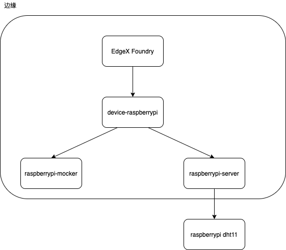

## 架构




## 集成测试

### 编译代码

```shell
make docker_build
make docker_push
```


### 启动服务

清理docker-proxy进程
```shell
sudo service docker stop
sudo rm -f /var/lib/docker/network/files/local-kv.db
```

```shell

make docker_compose_up
```

### 操作

设备信息查看
http://localhost:5000/

EdgexFoundry
http://localhost:4000/
